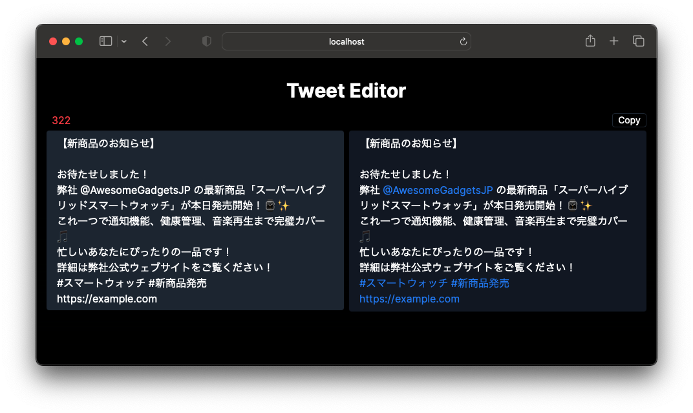

# Tweet Editor Example

A simple tweet editor coded by [ChatGPT](https://openai.com/blog/chatgpt). This app built with [Next.js](https://nextjs.org/) and [Tailwind CSS](https://tailwindcss.com/).



**Features:**

- Count the number of characters (turns red after 280 characters)
- URLs are uniformly counted at 22 characters
- The entered text will be displayed in a separate area
- Hashtags (#abc), handles (@123), and URLs are displayed in blue
- Copy text

## Run Locally

1. Clone the repo:

```sh
git clone https://github.com/komzweb/tweet-editor-example.git
```

2. Install dependencies:

```sh
npm install
# or
yarn
# or
pnpm
```

3. Run the server:

```sh
npm run dev
# or
yarn dev
# or
pnpm dev
```

Visit http://localhost:3000